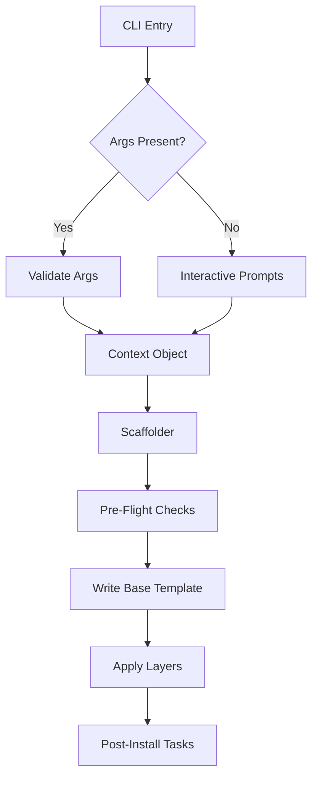

# CLI Scaffolding Architecture Best Practices

## 1. CLI Architecture

Modern scaffolding tools (create-next-app, create-vite) typically follow a "Pipeline" architecture.

**Core Components:**

- **Entry Point (`bin/cli.js`)**: Minimal logic, delegates to the main library.
- **Argument Parser**: `commander` (robust) or `minimist` (lightweight). Handles flags (`--ts`, `--no-install`).
- **Prompt Engine**: `prompts` (recommended) or `inquirer`. Handles interactive user input.
- **Context Object**: A single state object carrying user choices, paths, and calculated configuration.

**Flow Diagram:**

## 2. Template Generation Strategies

Avoid maintaining N×M distinct templates. Use the **Base + Layer** pattern.

- **Base Template**: The minimum viable file structure (e.g., React + Vite setup).
- **Feature Layers**: specific files or modifications applied on top (e.g., "Add Tailwind", "Add Sui Walrus").
- **File Handling**:
  - **Copy Strategy**: Recursive copy for static assets.
  - **Transform Strategy**: Use EJS/Handlebars for dynamic files (e.g., `manifest.json` with app name).
  - **Deep Merge**: JSON files (`package.json`, `tsconfig.json`) require intelligent merging.
    - _Pattern_: Read base `package.json`, merge `dependencies` from selected layers, sort keys alphabetically, write back.

## 3. Interactive Flow Design

User experience is critical.

- **Prompt Chaining**: Questions depend on previous answers (e.g., "Select Framework" -> "Select Variant").
- **Validation**:
  - **Project Name**: Regex check `vb-[a-z0-9-]+` (npm naming rules).
  - **Target Dir**: Ensure directory is empty or non-existent to prevent overwrites.
- **Compatibility Matrix**:
  - Enforce Node.js version early (`engines` field in package.json + runtime check).
  - Warn if selected tools have conflicting peer dependencies.

## 4. Post-Install Automation

Streamline the "Time to Hello World".

- **Dependency Installation**:
  - Detect User Agent (`npm_config_user_agent`) to use the user's preferred package manager (npm, pnpm, yarn, bun).
  - Run `install` command via `cross-spawn`.
- **Git Initialization**:
  - Run `git init` and create `.gitignore` immediately.
  - Create initial commit (optional, popularized by create-t3-app).
- **Next Steps Messaging**:
  - Clear, colored output (using `picocolors` or `chalk`).
  - "cd <project-name>"
  - "npm run dev"

## 5. Key Insights for `walrus-app`

1. **Hybrid Config**: Support both interactive mode and full CI/CD mode (all flags).
2. **Layered Architecture**: separate "Framework" (React/Vue) from "Walrus Features" (Client/Hooks) to allow mixing.
3. **Robust Merging**: Implement a dedicated `JsonMerger` utility for `package.json` to handle Walrus SDK dependencies cleanly.
4. **Resiliency**: Handle `SIGTERM` gracefully (cleanup created directories if the process is aborted).

## Sources

- **create-next-app**: Pipeline architecture, prompt handling.
- **create-vite**: Lightweight directory copying, high performance.
- **create-t3-app**: Excellent "Layering" of independent features (Prisma, Tailwind).
- **Commander.js**: Industry standard for argument parsing.
